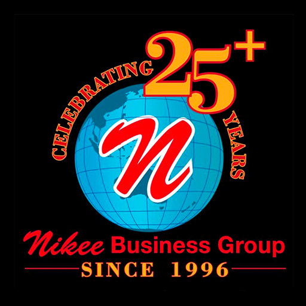
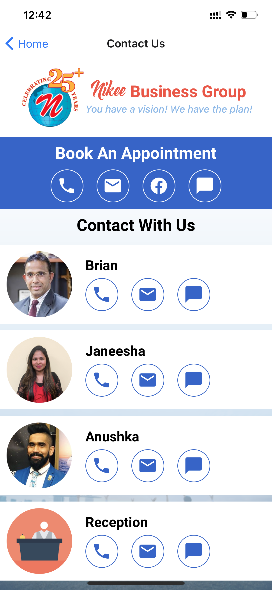
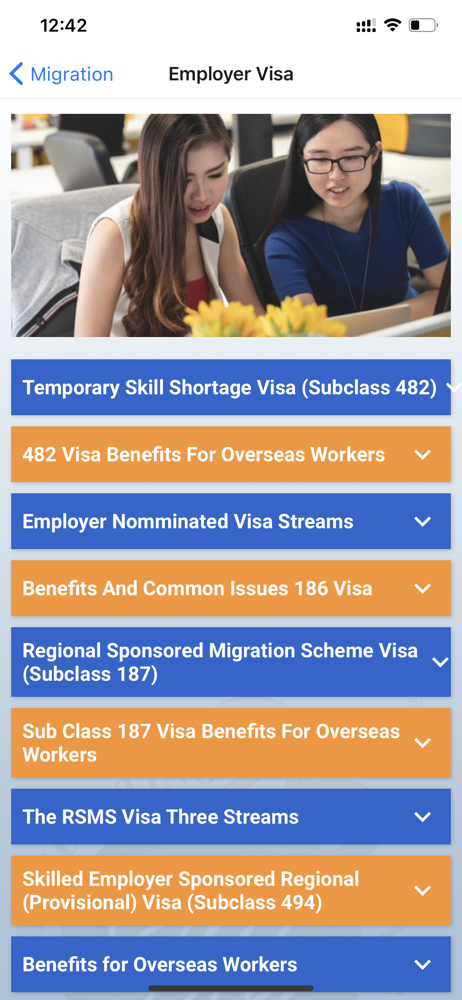

<!-- PROJECT LOGO -->
 

  

  <h1 align="center" >Nikee Business Group</h1>

  

    This is a mobile application for <a href="https://www.nikeeworld.com/"><strong>Nikee Business Group</strong></a> implemented with React Native.
     
    <a href="https://apps.apple.com/cn/app/nikee-business-group/id1565912023?l=en"><strong>Explore on App Store »</strong></a>
     
    <a href="https://play.google.com/store/apps/details?id=com.nikee.nikee"><strong>Explore on Google Play »</strong></a>
  

## Description

This is a [React Native](https://reactnative.dev/) informative mobile application where clients can contact consultants, get visa and migration services and update their profile. 

## ScreenShots

  
  
  
  
  
  

## Usage
1. cd to the current dictionary and run following command to install required packages:

`npm install`

2. Use following command to run this app on Expo Metro Bundler:

`npm start`

